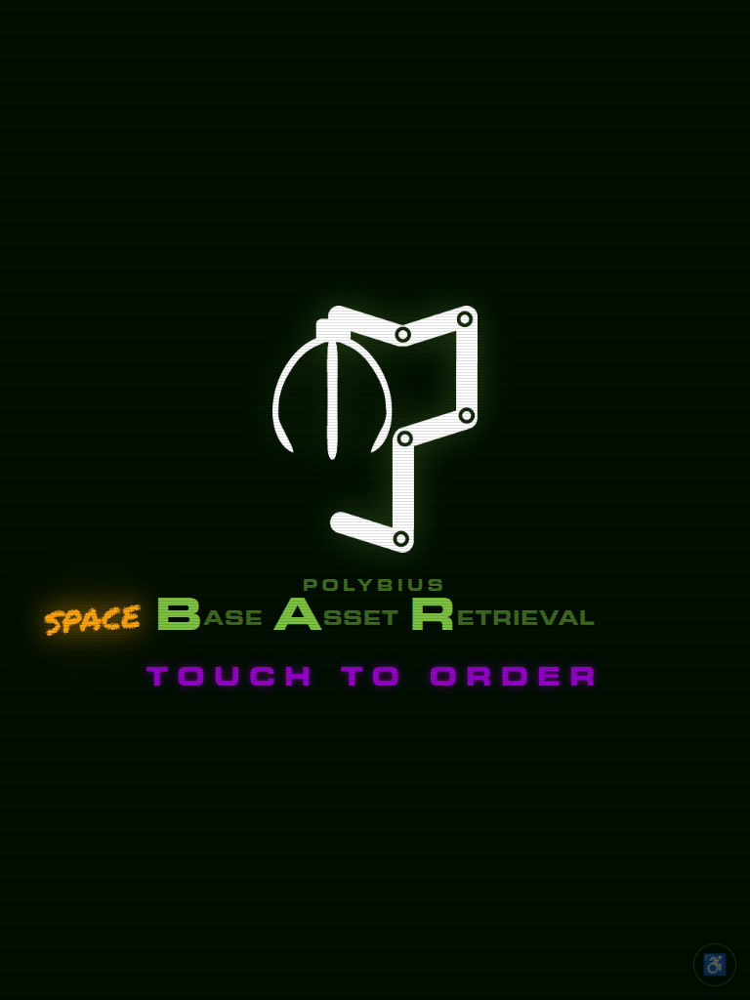
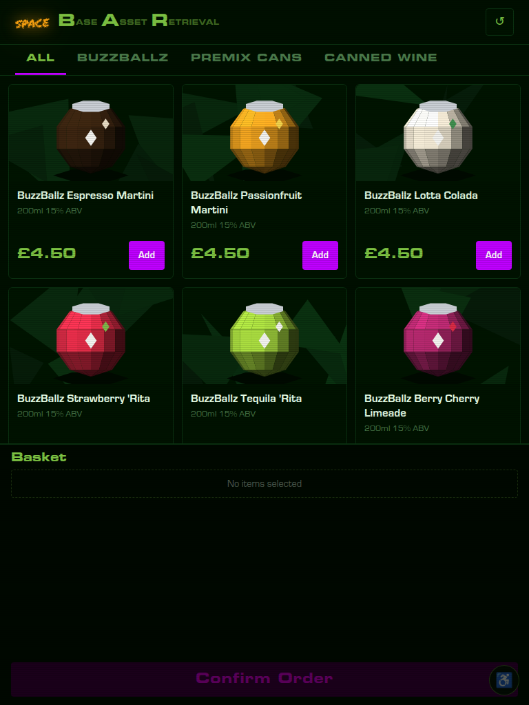
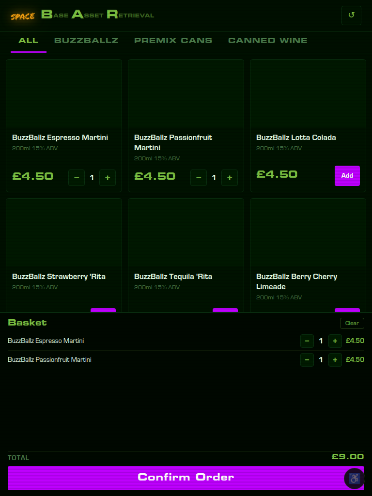
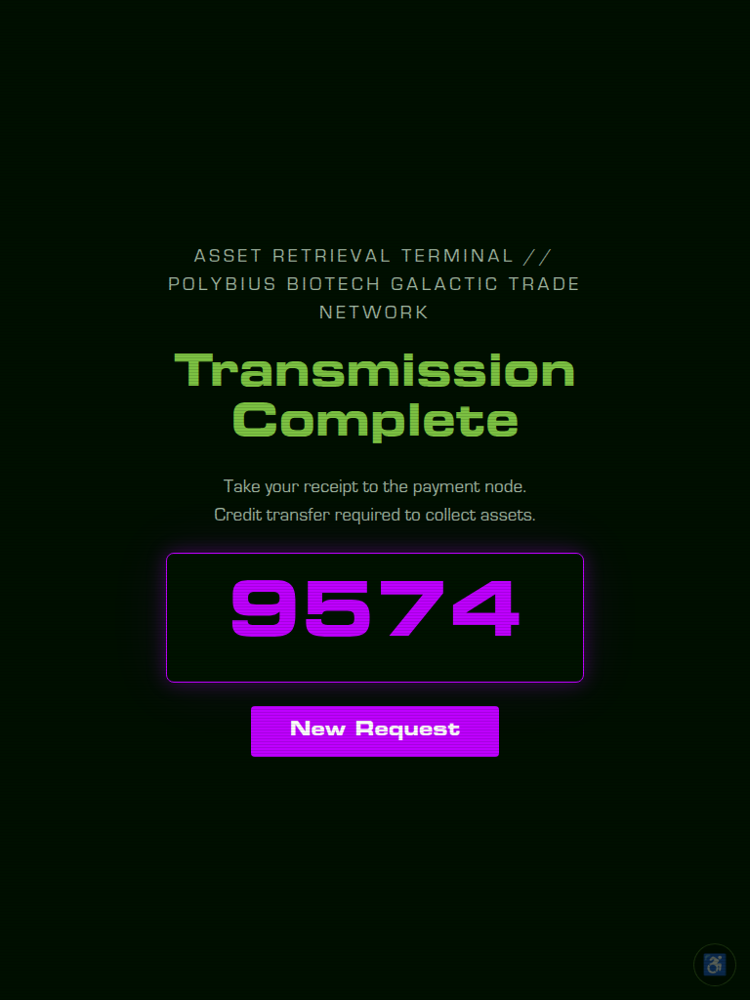

# Spacebar Kiosk

Customer-facing Raspberry Pi touchscreen kiosk for creating unpaid drink orders
in tillweb. The kiosk shows stock for one configured till location, sends the
basket to tillweb, prints the returned unpaid order slip locally, and shows the
customer the order ref to take to a human-operated till.

## Screenshots

| Sleep screen | Product grid | Basket | Order placed |
|:---:|:---:|:---:|:---:|
|  |  |  |  |

> Screenshots taken in mock mode (`KIOSK_MOCK_MODE=true`). Run `npm start` with those env vars to reproduce locally.

## Runtime Shape

- A Node.js server serves the kiosk UI on localhost (one runtime dependency: `qrcode` for slip generation). Slip printing is complete — ESC/POS + QR raster via `src/slip.js`. **Outstanding before site:** slip logo artwork (`logoBytes()` in `slip.js` currently returns an empty buffer — add the Polybius/Space Bar logo bitmap there), and a physical test print on the U220A to verify QR scale.
- The browser never sees the tillweb bearer token; the local server proxies API
  calls to tillweb.
- Slips print through CUPS using `lp` by default.
- Raspberry Pi kiosk mode is handled with systemd services for the server and
  Chromium.
- The UI is designed for a portrait touchscreen, with products above and the
  running basket plus `Confirm order` action fixed at the bottom of the screen.

## Local Development

```sh
cp .env.example .env
$EDITOR .env
npm start
```

For local UI work without a printer, set:

```sh
KIOSK_PRINT_ENABLED=false
KIOSK_MOCK_MODE=true
```

Then open `http://127.0.0.1:8080`.

## Raspberry Pi Install

On Raspberry Pi OS with Node.js 20+, Chromium, CUPS, and a configured printer:

```sh
sudo ./ops/install-pi.sh
sudoedit /etc/spacebar-kiosk.env
sudo systemctl restart spacebar-kiosk.service spacebar-kiosk-browser.service
```

Required settings:

- `TILLWEB_BASE_URL`: tillweb base URL, such as `https://till.example.org`.
- `TILLWEB_KIOSK_TOKEN`: bearer token from `emftillweb`'s
  `[kiosk.tokens]` configuration.
- `KIOSK_LOCATION`: tillweb stock/order location, default `spacebar`.

Useful optional settings:

- `KIOSK_PRINTER_NAME`: CUPS printer name. Blank uses the default printer.
- `KIOSK_PRINT_COMMAND`: `lp` or `lpr`.
- `KIOSK_PORT`: local HTTP port, default `8080`.

Remote operations — required if the kiosk is unattended:

- `KIOSK_OMS_URL`: base URL of the OMS server (e.g. `http://192.168.x.x:8081`). When set, printer errors are POSTed to `/api/printer-alert` so the OMS staff screen can alert bar staff. If not set, printer failures are visible on the kiosk screen but invisible to staff. Requires that the kiosk can reach the OMS server — confirm camp-network → VLAN routing with Luke before site.
- `KIOSK_LISTEN_HOST`: host to bind the local server, default `127.0.0.1`. Set to `0.0.0.0` if you need the kiosk UI reachable from another device.
- `KIOSK_DUMMY_PRINT`: if `true`, renders the slip to a file in `/tmp` instead of sending to CUPS. Useful for testing slip layout without a printer; auto-enabled in mock mode when `KIOSK_PRINT_ENABLED=true`.

## Operations

Check status:

```sh
systemctl status spacebar-kiosk.service
systemctl status spacebar-kiosk-browser.service
```

Read logs:

```sh
journalctl -u spacebar-kiosk.service -f
journalctl -u spacebar-kiosk-browser.service -f
```

Health check:

```sh
curl http://127.0.0.1:8080/healthz
```

## Customer Flow

Customers tap drinks to add them to the running basket at the bottom of the
screen, adjust quantities there, then press `Confirm order`. The kiosk creates
an unpaid order in tillweb, prints the order slip, and shows the order number.

If stock changes while the customer is ordering, the kiosk refreshes the product
list and asks them to review the basket. If the order is created but printing
fails, the kiosk shows a staff/help state and does not create another order.

## Product Images and Metadata

Category tabs are derived automatically from the quicktill **department** field
on each stocktype — no configuration needed. To change which tab a product
appears under, change its department in quicktill.

Per-product display overrides are configured in `public/products.json`. Two
ways to match a product:

- **By stockline ID** (numeric keys): exact match on quicktill
  `stockline.id`. Wins over name matching.
- **By name** (the `names` map): case-insensitive substring match against the
  product name. This is what ships by default — it survives stockline
  renumbering between events, so art stays attached no matter what IDs the
  till assigns. First matching key wins; keep specific keys ("nice fizz")
  before generic ones.

```json
{
  "42": { "image": "/images/products/some-beer.jpg", "category": "Craft Beer" },
  "names": {
    "sea change": { "image": "/images/products/wine-sea-change-0.svg", "category": "Canned Wine" }
  }
}
```

| Field | Description |
|---|---|
| `image` | URL of a product image. Put files in `public/images/products/` and reference as `/images/products/filename.jpg`. Recommended: at least 400 × 280 px (card image area is 140 px tall). |
| `category` | Overrides the quicktill department for tab assignment. Useful if the till department names don't match what you want shown on the kiosk, or to split one department across multiple tabs. |

Both fields are optional. Products without an entry show without an image and
use the quicktill department as their category.

Stockline IDs come from the quicktill database (`stockline.id`).

### Product art

The bundled product images are generated low-poly SVGs — flat-shaded polygon
facets, no gradients or filters, ~2–4 KB each — cheap for the Pi 4 to
rasterise and cache. Brand marks are abstracted to coloured shapes (the cola
mark is a red ribbon, not a logo). Regenerate or restyle with:

```sh
node scripts/generate-product-art.mjs
```

One image exists for every item in the planned site catalogue (8 BuzzBallz
flavours, 4 premix RTD cans, 4 canned wines), matched by name in
`products.json`. The mock catalogue in `src/server.js` mirrors the same 16
items, so mock mode exercises the full mapping end to end.

## Tillweb API

The kiosk server fetches products from the public EMF stockline API:

```text
GET /api/stocklines.json?output=full&type=continuous&location=<location>
```

It creates unpaid saved orders through the private kiosk API:

```text
POST /api/kiosk/orders.json
POST /api/kiosk/orders/expire.json
```

The private API still uses a bearer token. The browser UI never sees that token;
only the local Node.js server sends it to tillweb.
